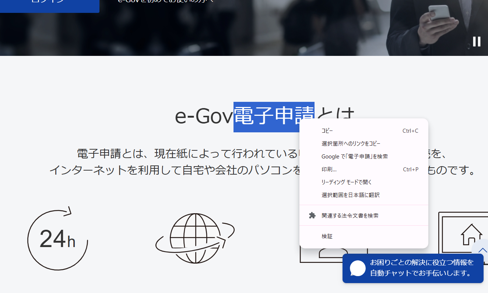
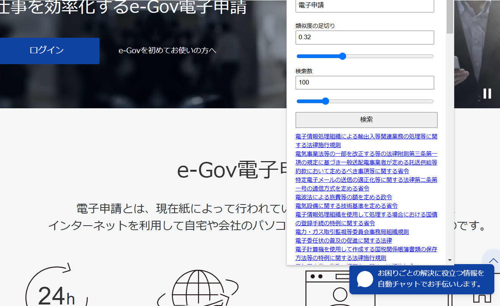

# lawscape

関連する法律文書の検索を行うchrome拡張です。

# インストール

手元にcloneし、chromeの拡張機能タブから「パッケージ化されていない拡張機能を読み込む」を選択し、読み込みます。

参考：<https://developer.chrome.com/docs/extensions/get-started/tutorial/hello-world?hl=ja#load-unpacked>

```sh
git clone https://github.com/lawscape/lawscape.git
```

# 使用例






---

(c) 2025 Naoki Kitano (puripuri2100)

[The MIT License](https://github.com/lawscape/lawscape/blob/master/LICENSE)
